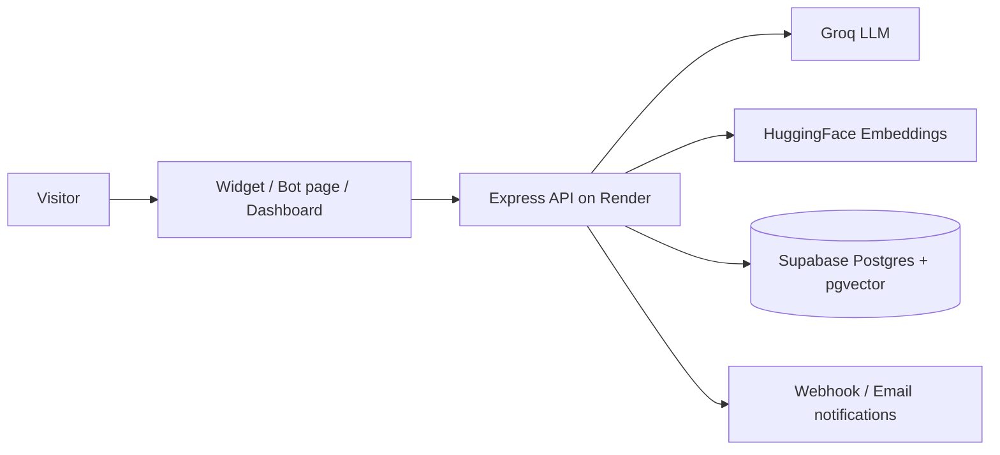

# ✨ Chitra AI

**Free-first, multi-tenant AI assistant platform for small businesses.**
Your bot learns your business (website, docs, FAQs), then chats with customers 24/7 — answering questions, booking appointments, and capturing leads.

> Full product plan: see [`idea.md`](./idea.md)

## Monorepo Layout
```
Chitra AI/
├── frontend/          # Next.js 14 dashboard → deploy on VERCEL
│   ├── pages/         # Landing, auth, onboarding, dashboard, knowledge, bookings, leads, settings
│   └── lib/           # Supabase client + API helper
├── backend/           # Express API → deploy on RENDER
│   ├── src/
│   │   ├── routes/    # chat, knowledge, bookings, leads, analytics, org, widget
│   │   ├── services/  # RAG, embeddings, Groq LLM, tools, ingest
│   │   └── middleware/# JWT auth, rate limiting
│   └── supabase/
│       └── schema.sql # Full DB schema + RLS + triggers (run once)
└── idea.md            # Product plan & architecture
```

## How the pieces connect


## Quick Start (local)

### 1. Database (one-time)
1. Create a free project at [supabase.com](https://supabase.com)
2. Open **SQL Editor** → paste & run `backend/supabase/schema.sql`
3. Get your URL + keys from **Project Settings → API**

### 2. Backend (Render locally too)
```bash
cd backend
npm install
cp .env.example .env        # add SUPABASE_URL, SUPABASE_SERVICE_ROLE_KEY, GROQ_API_KEY
npm run dev                 # http://localhost:5000
```
Get a free Groq key at [console.groq.com/keys](https://console.groq.com/keys) — no credit card.

### 3. Frontend
```bash
cd frontend
npm install
cp .env.example .env.local  # add Supabase URL/anon key + NEXT_PUBLIC_API_URL=http://localhost:5000
npm run dev                 # http://localhost:3000
```

### 4. Try it
1. Sign up at `localhost:3000/signup` (org auto-created by DB trigger)
2. Onboarding → crawl your website or paste business info
3. Test chat on the dashboard
4. Copy the `<script>` snippet into any website — chat widget appears 🎉

## Deployment

| Piece | Platform | Root dir | Notes |
|---|---|---|---|
| Frontend | **Vercel** | `frontend` | Add env vars; set `NEXT_PUBLIC_API_URL` to Render URL |
| Backend | **Render** | `backend` | Build `npm install`, start `npm start`, health check `/health` |
| Database | **Supabase** | — | Free tier: 500MB, 50k MAU |

After deploying:
- Set backend `CORS_ORIGINS=https://your-app.vercel.app`
- Set backend `PUBLIC_BACKEND_URL=https://your-api.onrender.com`

## Free-tier stack (no credit card anywhere)
- **Groq** — LLM (~14k requests/day free)
- **HuggingFace** — embeddings (or built-in local fallback embedder)
- **Supabase** — Postgres + pgvector + Auth + RLS tenant isolation
- **Render** — API hosting (750 hrs/month)
- **Vercel** — frontend hosting

## Feature status vs. idea.md roadmap
✅ V1: signup/onboarding, RAG Q&A, booking tools, web widget, test chat
✅ V2: multi-tenant RLS, knowledge uploads, lead capture, quotas, direct-link/QR page,
   WhatsApp/Messenger/Instagram integration, WordPress plugin, Drive/Notion sync
✅ V4: eSewa/Khalti payments (Pro Rs.1,500 / Agency Rs.4,500), plan enforcement,
   white-label widget theming, billing page, agency multi-client dashboard,
   PostHog analytics (env-gated)
🔜 Optional polish: custom domain routing for Pro widgets
